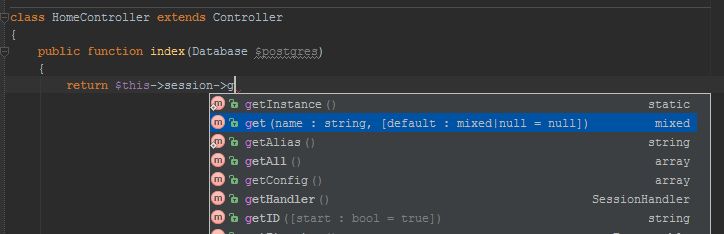

# Core Bindings and Components
Most of spiral core components (DBAL, Cache, Session, ...) has custom string alias like "dbal", this makes possible to receive component instance via magic getter in controller or application class.
```php
class MyControllers extends Controller
{
    public function index()
    {
        dump($this->dbal);
        return $this->view->render('home');
    }
}
```

List of all core component aliases:

Alias     | Component
---       | ---
core      | Will be binded to application or core instance.
http      | `Spiral\Components\Http\HttpDispatcher`
console   | `Spiral\Components\Console\ConsoleDispatcher`
loader    | `Spiral\Core\Loader`
modules   | `Spiral\Components\Modules\ModuleManager`
file      | `Spiral\Components\Files\FileManager`
debug     | `Spiral\Components\Debug\Debugger`
tokenizer | `Spiral\Components\Tokenizer\Tokenizer`
cache     | `Spiral\Components\Cache\CacheManager`
i18n      | `Spiral\Components\Localization\Translator`
view      | `Spiral\Components\View\ViewManager`
redis     | `Spiral\Components\Redis\RedisManager`
encrypter | `Spiral\Components\Encrypter\Encrypter`
image     | `Spiral\Components\Image\ImageManager`
storage   | `Spiral\Components\Storage\StorageManager`
dbal      | `Spiral\Components\DBAL\DatabaseManager`
orm       | `Spiral\Components\ORM\ORM`
odm       | `Spiral\Components\ODM\ODM`
cookies   | `Spiral\Components\Http\Cookies\CookieManager`
session   | `Spiral\Components\Session\SessionStore`

Some aliases will be availble only inside `HttpDispatcher` scope:

Alias     | Component
---       | ---
request   | `Spiral\Components\Http\Request`
router    | `Spiral\Components\Http\Router\Router` Only inside router scope.

> All aliases listed in Controller and Core doc comments, so your IDE will highlight their methods.

